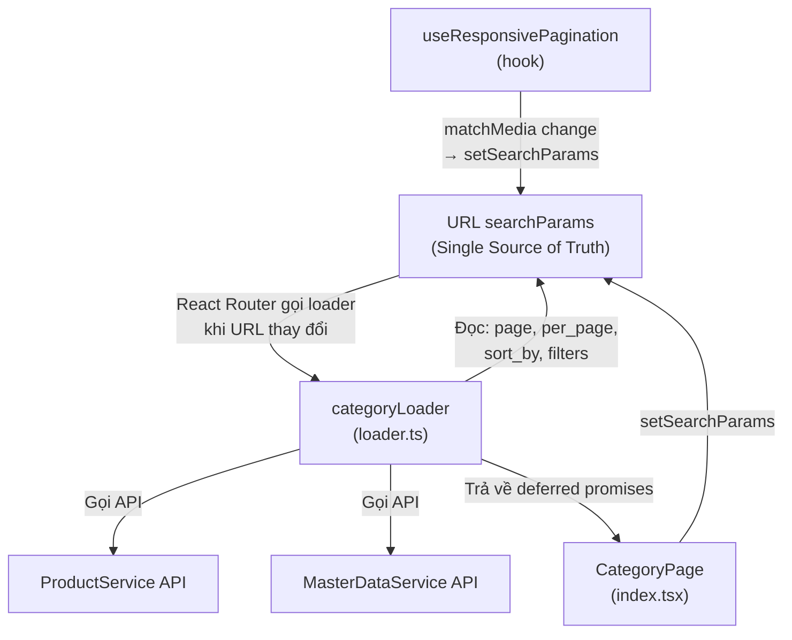
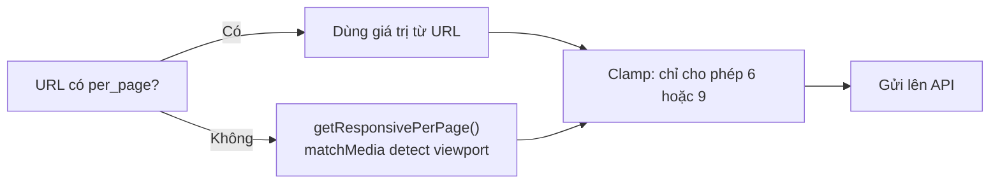
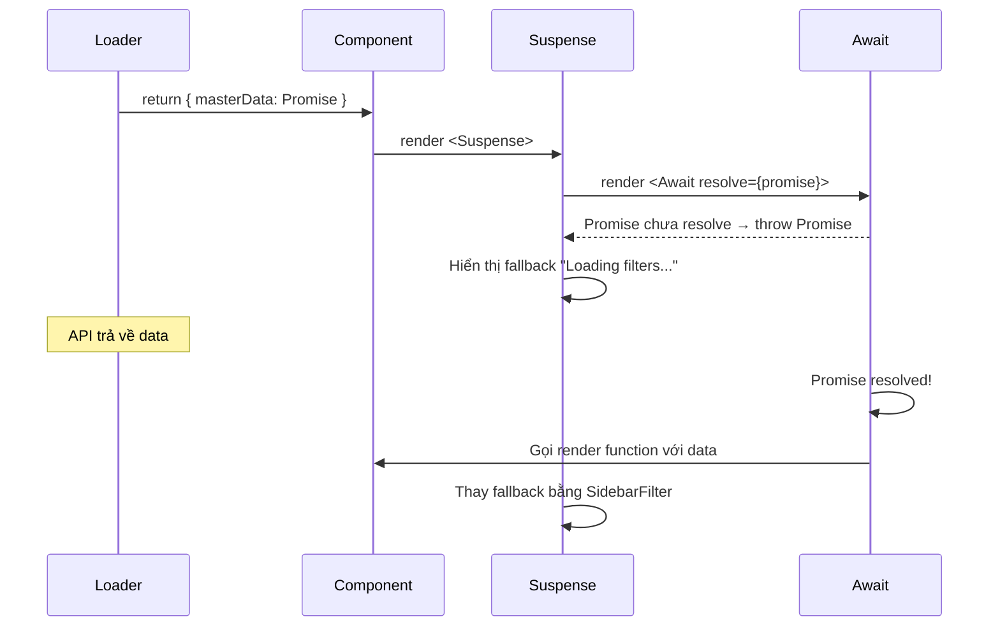
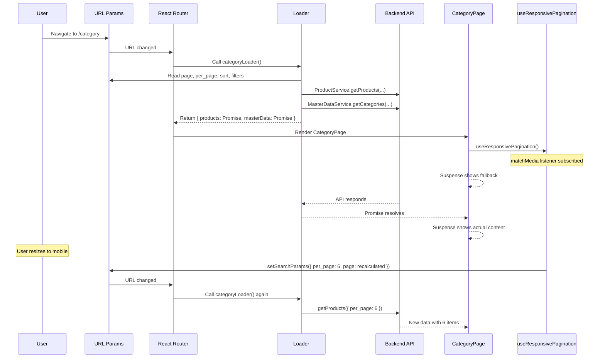

# Category Page — Giải thích chi tiết

## Tổng quan kiến trúc



> [!IMPORTANT]
> Mọi state quan trọng (page, per_page, sort, filters) đều sống trong **URL searchParams**. Không có React state riêng cho chúng. Khi URL thay đổi → React Router tự chạy lại loader → component nhận data mới.

---

## File 1: [loader.ts](file:///d:/Code/shopco-react/src/pages/Category/loader.ts)

Loader là hàm chạy **trước khi component render**. React Router gọi nó mỗi khi URL thay đổi (navigate, setSearchParams, etc.).

---

### L1–15: Imports

```typescript
import type { LoaderFunctionArgs } from "react-router-dom";
import { ProductService } from "@/services/product.service";
import { MasterDataService } from "@/services/master-data.service";
import { mapProductCardData } from "@/utils/mappers/product.mapper";
import { CATEGORY_PER_PAGE_DESKTOP } from "@/consts/config";
import { getResponsivePerPage } from "@/hooks/useResponsivePagination";
```

| Import | Mục đích |
|---|---|
| `LoaderFunctionArgs` | Type cho tham số loader — chứa `request` object với URL hiện tại |
| `ProductService` | Service gọi API lấy danh sách sản phẩm |
| `MasterDataService` | Service gọi API lấy dữ liệu filter (categories, colors, sizes, styles) |
| `mapProductCardData` | Mapper chuyển response API thành `ProductCardData` type cho UI |
| `CATEGORY_PER_PAGE_DESKTOP` | Constant = 9 (fallback mặc định) |
| `getResponsivePerPage` | Hàm dùng `matchMedia` detect viewport → trả 6 hoặc 9 |

---

### L17–34: Sort options & Type definition

```typescript
export const SORT_OPTIONS = [
  { id: "popular", label: "Most Popular" },
  { id: "newest", label: "Newest" },
  { id: "price-asc", label: "Price: Low to High" },
  { id: "price-desc", label: "Price: High to Low" },
];

export interface CategoryLoaderData {
  products: Promise<{...}>;       // ← Promise, KHÔNG phải data thuần
  masterData: Promise<[...]>;     // ← Promise
  sortData: typeof SORT_OPTIONS;  // ← Data thuần (sync)
}
```

> [!NOTE]
> **`products` và `masterData` là Promise** — đây là pattern **Deferred Data** của React Router. Loader trả về promise chưa resolve → component render ngay với Suspense fallback → khi promise resolve thì hiển thị data thật. Lợi ích: trang load nhanh hơn vì không chờ ALL API calls xong mới render.

---

### L36–56: Pagination logic

```typescript
export const categoryLoader = ({ request }: LoaderFunctionArgs) => {
  const url = new URL(request.url);

  const page = Number(url.searchParams.get("page")) || 1;

  const perPageParam = url.searchParams.get("per_page");
  const per_page = perPageParam
    ? Number(perPageParam)        // URL đã có → dùng luôn
    : getResponsivePerPage();     // Chưa có → detect viewport bằng matchMedia

  const safePer_page = [6, 9].includes(per_page)
    ? per_page
    : CATEGORY_PER_PAGE_DESKTOP;  // Safety: chỉ chấp nhận 6 hoặc 9
};
```

**Flow xử lý `per_page`:**



- **Lần đầu truy cập**: URL chưa có `per_page` → gọi `getResponsivePerPage()` → dùng `window.matchMedia("(max-width: 768px)")` → trả 6 (mobile) hoặc 9 (desktop)
- **Lần sau**: Hook đã set `per_page` vào URL → loader đọc trực tiếp
- **Safety net**: `[6, 9].includes(per_page)` — nếu user sửa URL thành `per_page=999`, fallback về 9

---

### L58–81: Sort mapping

```typescript
const sortParam = url.searchParams.get("sort_by") || "popular";

switch (sortParam) {
  case "newest":
    sortBy = "created_at"; sortDir = "desc"; break;
  case "price-asc":
    sortBy = "price"; sortDir = "asc"; break;
  case "price-desc":
    sortBy = "price"; sortDir = "desc"; break;
  case "popular":
  default:
    sortBy = "selling"; sortDir = "desc"; break;
}
```

**Tại sao cần mapping?** UI dùng tên đơn giản (`"newest"`, `"price-asc"`), nhưng API cần 2 tham số riêng biệt (`sort_by` + `sort_dir`). Loader đóng vai trò **adapter** giữa UI và API.

| URL param | API sort_by | API sort_dir |
|---|---|---|
| `popular` (default) | `selling` | `desc` |
| `newest` | `created_at` | `desc` |
| `price-asc` | `price` | `asc` |
| `price-desc` | `price` | `desc` |

---

### L83–98: Filter extraction

```typescript
const category_slug = url.searchParams.get("category_slug") || undefined;
const colors = colorsParam ? colorsParam.split(",") : undefined;
const sizes = sizesParam ? sizesParam.split(",") : undefined;
// ... tương tự cho style_slugs, min_price, max_price
```

Các filter được lưu trong URL dạng comma-separated string → loader split thành array cho API:
- URL: `?colors=red,blue&sizes=S,M`
- API nhận: `{ colors: ["red", "blue"], sizes: ["S", "M"] }`

---

### L100–131: API calls & Return

```typescript
const productsPromise = ProductService.getProducts({
  page, per_page: safePer_page, sort_by: sortBy, sort_dir: sortDir,
  category_slug, colors, sizes, style_slugs, min_price, max_price,
}).then((res) => ({
  data: res.data.map(mapProductCardData),  // Map raw API → UI type
  total: res.meta?.total || 0,
  currentPage: res.meta?.current_page || 1,
  lastPage: res.meta?.last_page || 1,
  perPage: safePer_page,                   // Trả lại per_page để component dùng
}));

const masterDataPromise = Promise.all([
  MasterDataService.getCategories(true).then((res) => res.data),
  MasterDataService.getColors().then((res) => res.data),
  MasterDataService.getSizes().then((res) => res.data),
  MasterDataService.getStyles().then((res) => res.data),
]);

return {
  products: productsPromise,    // ← Trả Promise (deferred)
  masterData: masterDataPromise, // ← Trả Promise (deferred)
  sortData: SORT_OPTIONS,        // ← Trả data thuần (sync)
};
```

> [!TIP]
> **Deferred pattern**: Loader return **Promise** thay vì `await` kết quả. React Router sẽ render component NGAY, component dùng `<Suspense>` + `<Await>` để hiển thị fallback trong khi chờ promise resolve. Điều này cho phép:
> - Breadcrumb, layout render ngay (không chờ API)
> - Products và filters load song song (parallel)
> - Mỗi phần có fallback riêng

---

## File 2: [index.tsx](file:///d:/Code/shopco-react/src/pages/Category/index.tsx) (Component)

---

### L21–36: Hooks & State đọc từ URL

```typescript
const { products, masterData, sortData } =
  useLoaderData() as CategoryLoaderData;        // Lấy data từ loader
const [searchParams, setSearchParams] = useSearchParams(); // Đọc/ghi URL params
const location = useLocation();                  // location.search cho Suspense key
const navigation = useNavigation();              // Theo dõi trạng thái loading

useResponsivePagination();  // Hook sync per_page với viewport

const sortValue = searchParams.get("sort_by") || "popular";
const currentPage = Number(searchParams.get("page")) || 1;
const isNavigating = navigation.state === "loading";
```

**Giải thích từng hook:**

| Hook | Vai trò |
|---|---|
| `useLoaderData()` | Nhận object `{ products, masterData, sortData }` mà loader trả về |
| `useSearchParams()` | Đọc/ghi URL query string — thay đổi nó sẽ trigger loader chạy lại |
| `useLocation()` | Lấy `location.search` — dùng làm `key` cho Suspense |
| `useNavigation()` | Biết trạng thái hiện tại: `"idle"` / `"loading"` / `"submitting"` |
| `useResponsivePagination()` | Lắng nghe matchMedia → auto-update per_page + page trong URL |

---

### L38–50: Sort & Page handlers

```typescript
const handleSortChange = (newSort: string) => {
  setSearchParams((prev) => {
    prev.set("sort_by", newSort);
    return prev;
  });
};

const handlePageChange = (newPage: number) => {
  setSearchParams((prev) => {
    prev.set("page", newPage.toString());
    return prev;
  });
};
```

**Pattern quan trọng**: Dùng callback form `setSearchParams((prev) => ...)` để giữ lại các params khác (page, filters, per_page) khi chỉ thay đổi 1 param. Nếu dùng `setSearchParams({ sort_by: "newest" })` thì sẽ XÓA hết params khác.

```
Trước: ?page=2&sort_by=popular&colors=red&per_page=9
Sau handleSortChange("newest"):
       ?page=2&sort_by=newest&colors=red&per_page=9
                       ^^^^^^ chỉ đổi mỗi cái này
```

---

### L52–86: Filter handler

```typescript
const handleApplyFilter = (filters: {...}) => {
  setSearchParams((prev) => {
    prev.delete("page");  // ← QUAN TRỌNG: reset page về 1 khi filter thay đổi

    // Mỗi filter: có giá trị → set, không có → delete
    if (filters.category_slug) prev.set("category_slug", filters.category_slug);
    else prev.delete("category_slug");

    if (filters.colors?.length) prev.set("colors", filters.colors.join(","));
    else prev.delete("colors");
    // ... tương tự cho sizes, style_slugs, min_price, max_price
  });
};
```

> [!IMPORTANT]
> `prev.delete("page")` — Khi user thay đổi filter, LUÔN reset về trang 1. Lý do: nếu đang ở page 5 và filter mới chỉ có 2 trang kết quả → page 5 sẽ trống. React Router sẽ thêm `page=1` tự động vì `currentPage` default là 1.

**Chiến lược set/delete:**
- Filter có giá trị → `prev.set()` (thêm/cập nhật vào URL)
- Filter rỗng → `prev.delete()` (xóa khỏi URL để URL sạch)

```
Ví dụ URL khi filter:
/category?category_slug=shorts&colors=red,blue&min_price=50&max_price=150

Khi bỏ filter colors:
/category?category_slug=shorts&min_price=50&max_price=150
                                ← "colors" bị xóa khỏi URL
```

---

### L89–110: Active filters & Dynamic title

```typescript
// Đọc ngược URL → object để truyền cho SidebarFilter (giữ trạng thái filter)
const activeFilters = {
  category_slug: searchParams.get("category_slug") || undefined,
  colors: searchParams.get("colors")?.split(","),
  // ... etc
  min_price: searchParams.get("min_price") ? Number(...) : 0,
  max_price: searchParams.get("max_price") ? Number(...) : 100,
};

// Title động theo URL params
const categorySlug = searchParams.get("category_slug");
const styleSlug = searchParams.get("style_slugs");
const pageTitle = formatSlugToTitle(categorySlug || styleSlug) || "All Products";
```

**Luồng dữ liệu vòng tròn của filters:**

```
URL ──→ activeFilters ──→ SidebarFilter (hiển thị trạng thái)
 ↑                              │
 └──── handleApplyFilter ◄──────┘ (user thay đổi filter)
```

**Dynamic title logic:**

| URL | `categorySlug` | `styleSlug` | `pageTitle` |
|---|---|---|---|
| `/category` | `null` | `null` | `"All Products"` |
| `?category_slug=shorts` | `"shorts"` | — | `"Shorts"` |
| `?style_slugs=casual` | `null` | `"casual"` | `"Casual"` |
| `?category_slug=t-shirts` | `"t-shirts"` | — | `"T-Shirts"` |

---

### L112–135: Layout + Sidebar (Deferred loading)

```tsx
<main className="category-page">
  <div className="container">
    <Breadcrumb items={breadcrumbItems} />    {/* Render ngay */}

    <CategoryLayout
      sidebar={
        <Suspense fallback={<div>Loading filters...</div>}>  {/* Fallback riêng */}
          <Await resolve={masterData}>     {/* Chờ masterData promise resolve */}
            {([cats, cols, szi, styls]) => (
              <SidebarFilter
                categories={cats}
                colors={cols}
                sizes={szi}
                styles={styls}
                initialFilters={activeFilters}
                onApplyFilter={handleApplyFilter}
              />
            )}
          </Await>
        </Suspense>
      }
    >
```

**`<Await resolve={masterData}>`** hoạt động thế nào:



---

### L137–194: Product grid + Loading overlay

```tsx
{/* Wrapper với loading overlay */}
<div className={`category-page__content${isNavigating ? " --loading" : ""}`}>
  <Suspense
    key={location.search}    {/* ← KEY quan trọng */}
    fallback={<div>Loading products...</div>}
  >
    <Await resolve={products}>
      {({ data, total, lastPage, perPage }) => {
        // Tính "Showing 1-9 of 45 Products"
        const showingStart = total === 0 ? 0 : (currentPage - 1) * perPage + 1;
        const showingEnd = Math.min(currentPage * perPage, total);

        return (
          <>
            <ProductGridHeader title={pageTitle} ... />
            <ProductGrid>
              {data.map((product) => (
                <ProductCard key={product.id} product={product} />
              ))}
            </ProductGrid>
            {total > 0 && <PaginationBox ... />}
          </>
        );
      }}
    </Await>
  </Suspense>
</div>
```

**3 cơ chế quan trọng ở đây:**

#### 1. `key={location.search}` trên Suspense

Khi URL search thay đổi (page, sort, filter) → key thay đổi → React **unmount rồi remount** Suspense → hiển thị fallback lại → chờ promise mới resolve. Không có `key` thì Suspense sẽ giữ data cũ, gây hiển thị sai.

#### 2. Loading overlay (`isNavigating`)

```
navigation.state === "loading"
  → thêm class "category-page__content--loading"
  → CSS: opacity: 0.5 + pointer-events: none
  → Giữ nguyên content cũ, dim nhẹ, không cho click
```

Tại sao cần cả Suspense fallback VÀ loading overlay?
- **Suspense fallback**: Lần đầu load (chưa có data cũ) → hiện "Loading products..."
- **Loading overlay**: Đã có data cũ, đang load data mới → dim content cũ, user vẫn thấy products

#### 3. `perPage` từ loader data

```typescript
const showingStart = (currentPage - 1) * perPage + 1; // Page 2, perPage 9 → item 10
const showingEnd = Math.min(currentPage * perPage, total); // Min(18, 45) → 18
// Kết quả: "Showing 10-18 of 45 Products"
```

`perPage` được loader trả về (không hardcode) → khi responsive thay đổi per_page, text hiển thị cũng đúng theo.

---

## Data Flow tổng thể


